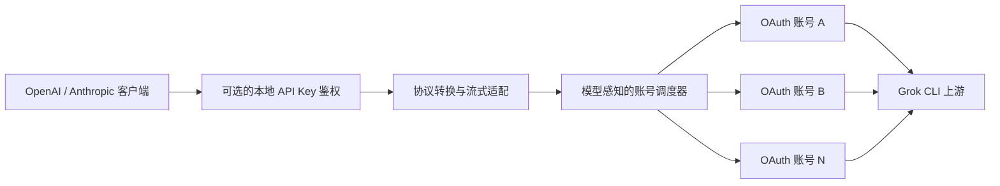

<div align="center">

# grokcli2api-go

**将 Grok CLI 上游能力转换为 OpenAI 与 Anthropic 兼容 API**

轻量、可部署、支持流式响应与多账号调度的 Go 兼容层

[](https://github.com/Futureppo/grokcli2api-go/actions/workflows/ci.yml)
[](https://go.dev/)
[](LICENSE)
[](https://github.com/Futureppo/grokcli2api-go/pkgs/container/grokcli2api-go)

[一键部署](#一键部署linux) · [快速开始](#快速开始) · [API 兼容性](#api-兼容性) · [配置说明](#配置说明) · [接口一览](#接口一览) · [参与贡献](#开发与贡献)

**简体中文** · [English](README_EN.md)

</div>

---

`grokcli2api-go` 是一个使用 Go 编写的非官方 API 兼容服务。它将 Grok CLI 使用的上游接口转换为 OpenAI Chat Completions、OpenAI Responses 与 Anthropic Messages 格式，让现有应用通常只需调整 API Base URL 即可接入。

项目运行时仅依赖 Go 标准库，提供多账号 OAuth 凭证池、自动刷新、模型发现、会话亲和、失败重试与容量背压等能力，适合本地开发、内网服务和容器化部署。

> [!IMPORTANT]
> 本项目是非官方兼容层，与 xAI、X、OpenAI 或 Anthropic 均无隶属或合作关系。使用者应自行遵守相关服务条款，并承担使用非公开上游接口可能产生的兼容性、可用性与账号风险。

## 核心能力

| 类别 | 能力 |
| --- | --- |
| API 兼容 | OpenAI Chat Completions、OpenAI Responses、Anthropic Messages、Grok CLI 原生 Responses 透传 |
| 响应模式 | 流式 SSE 与非流式响应，兼容常见 SDK 和 HTTP 客户端 |
| 凭证管理 | 多账号 OAuth 凭证池、自动刷新、目录热加载、刷新结果原子写回 |
| 智能调度 | 账号轮询、会话亲和、按模型能力调度、失败重试与额度冷却 |
| 并发治理 | 账号级并发上限与容量背压，降低高并发场景下的 429 重试风暴 |
| 模型发现 | 按账号获取上游模型目录，缓存、聚合并输出去重后的模型列表 |
| 访问保护 | 可配置一个或多个本地 API Key，兼容 Bearer、`x-api-key` 与 `api-key` 请求头 |
| 网络支持 | HTTP、HTTPS、SOCKS5、SOCKS5H 出站代理及标准 `NO_PROXY` 规则 |
| 部署体验 | 单一二进制、优雅退出、Docker 多阶段构建与 Docker Compose 编排 |

## 工作原理



针对不同订阅类型优化，每个请求只会调度到声明支持目标模型的有效账号。

## API 兼容性

| 协议 | 接口 | 流式 | 非流式 |
| --- | --- | :---: | :---: |
| OpenAI | `POST /v1/chat/completions` | ✓ | ✓ |
| OpenAI | `POST /v1/responses` | ✓ | ✓ |
| Anthropic | `POST /v1/messages` | ✓ | ✓ |
| OpenAI | `GET /v1/models` | — | ✓ |

兼容层会尽可能保留常用的请求字段、响应结构和流式事件，但不保证覆盖官方 API 的全部参数与行为。接入 New API 等 API 聚合项目时，请开启所有请求参数的**透传**。

## 快速开始

### 一键部署（Linux）

服务器已安装 Docker 与 Docker Compose v2 时，可直接运行：

```bash
bash <(curl -fsSL https://raw.githubusercontent.com/Futureppo/grokcli2api-go/main/scripts/deploy.sh)
```

脚本会检查 Docker 环境、下载 Compose 配置、创建受保护的 `.env` 和 `auths/` 目录、生成随机本地 API Key、导入你指定的 OAuth JSON 凭证，并启动及验证服务。交互执行时按提示输入凭证文件路径即可；已有安装会保留 `.env` 与凭证，可用同一条命令完成镜像更新。

无人值守部署可预先传入参数：

```bash
AUTH_FILE=/root/account.json \
GROK_API_KEYS='sk-change-this-to-a-strong-random-key' \
INSTALL_DIR=/opt/grokcli2api-go \
bash <(curl -fsSL https://raw.githubusercontent.com/Futureppo/grokcli2api-go/main/scripts/deploy.sh)
```

可选变量包括 `GROK2API_PORT`（默认 `8088`）、`INSTALL_DIR`（默认 `~/grokcli2api-go`）、`AUTH_FILE` 与 `GROK_API_KEYS`。未提供凭证时，脚本只初始化安全配置而不会启动一个无法工作的服务。

> [!TIP]
> 一键脚本解决的是服务部署，不会替你获取上游凭证。OAuth JSON 属于敏感信息，请只从可信来源导出，并在服务器上以最小权限保存。正式对公网开放前还应配置 HTTPS、反向代理、访问控制和限流。

### 1. 准备项目

运行前需要：

- Docker 与 Docker Compose，或 Go 1.23 及以上版本；
- 至少一份有效的 Grok CLI OAuth JSON 凭证；
- 一个可写的凭证目录。

```bash
git clone https://github.com/Futureppo/grokcli2api-go.git
cd grokcli2api-go
cp .env.example .env
mkdir auths
```

Windows PowerShell：

```powershell
git clone https://github.com/Futureppo/grokcli2api-go.git
Set-Location grokcli2api-go
Copy-Item .env.example .env
New-Item -ItemType Directory -Force auths
```

将每个账号的 OAuth JSON 文件直接放在 `auths/` 下，一份文件对应一个账号：

```text
auths/
├── account-1.json
├── account-2.json
└── account-n.json
```

凭证通常需要包含可用的访问令牌、刷新信息与稳定的账号标识。服务只扫描该目录的第一层，不递归读取子目录。

> [!CAUTION]
> `auths/` 已被 Git 忽略，但仍应作为敏感目录妥善保管。服务会热加载凭证，并将刷新后的令牌和模型目录写回原文件，因此目录与文件必须可写。

### 2. 配置本地访问密钥

编辑 `.env`，将示例值替换为仅供你使用的强随机密钥：

```dotenv
GROK_API_KEYS=sk-kfcvivo50
```

本地 API Key 只用于保护当前服务，与上游 OAuth 凭证相互独立。留空可关闭访问保护，但不建议在任何可被其他设备访问的环境中这样做。

### 3. 启动服务

#### Docker Compose（推荐）

```bash
docker compose up -d
docker compose ps
```

查看日志或停止服务：

```bash
docker compose logs -f
docker compose down
```

#### 从源码运行

```bash
go run ./cmd/grok2api
```

#### 使用预构建镜像

```bash
docker pull ghcr.io/futureppo/grokcli2api-go:latest
docker run --rm -p 8088:8088 --env-file .env \
  -v "$(pwd)/auths:/auths" \
  -e GROK_AUTHS_DIR=/auths \
  ghcr.io/futureppo/grokcli2api-go:latest
```

Docker Compose 默认拉取并运行 `ghcr.io/futureppo/grokcli2api-go:latest`。每次推送都会发布 `sha-<commit>` 与对应分支标签，`main` 分支还会更新 `latest`。

### 4. 验证服务

服务默认监听 `http://0.0.0.0:8088`。请将下面的 Key 替换为 `.env` 中的实际值：

```bash
curl http://localhost:8088/

curl http://localhost:8088/v1/models \
  -H "Authorization: Bearer sk-kfcvivo50"
```

## 调用示例

以下示例均使用 `sk-kfcvivo50` 作为占位符，请替换为自己的本地 API Key。

### OpenAI Chat Completions

```bash
curl http://localhost:8088/v1/chat/completions \
  -H "Content-Type: application/json" \
  -H "Authorization: Bearer sk-kfcvivo50" \
  -d '{
    "model": "grok-4.5",
    "messages": [
      {"role": "user", "content": "Hello!"}
    ]
  }'
```

### OpenAI Responses

```bash
curl http://localhost:8088/v1/responses \
  -H "Content-Type: application/json" \
  -H "Authorization: Bearer sk-kfcvivo50" \
  -d '{
    "model": "grok-4.5",
    "input": "Explain what an API compatibility layer does."
  }'
```

### Anthropic Messages

```bash
curl http://localhost:8088/v1/messages \
  -H "Content-Type: application/json" \
  -H "x-api-key: sk-kfcvivo50" \
  -H "anthropic-version: 2023-06-01" \
  -d '{
    "model": "grok-4.5",
    "max_tokens": 512,
    "messages": [
      {"role": "user", "content": "Hello!"}
    ]
  }'
```

未设置 `GROK_API_KEYS` 或 `GROK_API_KEY` 时，应移除示例中的本地 API Key 请求头。

## 会话亲和与账号调度

当多个客户端共享同一个本地 API Key 时，建议为每段会话发送稳定且不包含敏感信息的标识：

```http
X-Grok-Session-ID: conversation-123
```

服务也会依次识别以下字段作为亲和标识：

- OpenAI `prompt_cache_key`
- OpenAI `previous_response_id`
- OpenAI `user`
- Anthropic `metadata.user_id`

本地 API Key 与客户端 IP 不会被用作账号亲和标识。亲和关系仅保存在内存中，并受 TTL 与容量上限控制。

## 配置说明

程序会从当前工作目录的 `.env` 文件中加载尚未设置的环境变量。完整模板与高级客户端标识选项见 [`.env.example`](.env.example)。

### 服务配置

| 环境变量 | 未设置时的默认值 | 说明 |
| --- | --- | --- |
| `GROK2API_HOST` | `0.0.0.0` | 服务监听地址 |
| `GROK2API_PORT` | `8088` | 服务监听端口 |
| `GROK2API_LOG_LEVEL` | `INFO` | 日志等级：`DEBUG`、`INFO`、`WARN` 或 `ERROR` |
| `GROK_API_KEYS` | 空 | 逗号分隔的本地访问密钥，可为不同客户端分配独立 Key |
| `GROK_API_KEY` | 空 | 单个本地访问密钥的兼容别名 |

启用本地访问保护后，受保护接口接受以下任一种请求头：

- `Authorization: Bearer <key>`
- `x-api-key: <key>`
- `api-key: <key>`

### 凭证池与调度

| 环境变量 | 未设置时的默认值 | 说明 |
| --- | --- | --- |
| `GROK_AUTHS_DIR` | `./auths` | 非递归扫描的可写 OAuth JSON 目录 |
| `GROK_AUTHS_RELOAD_INTERVAL` | `30s` | 凭证目录热加载周期 |
| `GROK_AUTH_REFRESH_CONCURRENCY` | `4` | OAuth 刷新的最大并发数 |
| `GROK_ACCOUNT_MAX_INFLIGHT` | `16` | 每账号最大上游在途请求数，超出后等待可用容量 |
| `GROK_MODELS_REFRESH_INTERVAL` | `6h` | 每个账号模型目录的刷新周期 |
| `GROK_RETRY_MAX_ATTEMPTS` | `3` | 单个请求最多尝试的不同账号数 |
| `GROK_RETRY_BASE_DELAY` | `200ms` | 可重试网络错误与上游 5xx 错误的基础退避时间 |
| `GROK_RATE_LIMIT_COOLDOWN` | `1m` | 上游 429 未提供 `Retry-After` 时的冷却时间 |
| `GROK_QUOTA_COOLDOWN` | `24h` | 额度耗尽后的默认冷却时间 |
| `GROK_AFFINITY_TTL` | `1h` | 内存会话亲和关系的有效期 |
| `GROK_AFFINITY_MAX_ENTRIES` | `100000` | 会话亲和缓存的容量上限 |

免费模型额度按账号与模型隔离；账号支出额度耗尽时，整个账号会进入冷却。

### 上游与网络

| 环境变量 | 未设置时的默认值 | 说明 |
| --- | --- | --- |
| `GROK_CHAT_PROXY_BASE_URL` | `https://cli-chat-proxy.grok.com` | Grok CLI 上游地址 |
| `GROK_CHAT_PROXY_VERSION` | `v1` | 上游 API 版本 |
| `GROK_STREAM_COMPRESSION` | `identity` | `identity` 避免 gzip 缓冲 SSE；`gzip` 用于兼容回退 |
| `GROK_PROXY_URL` | 空 | 出站代理，支持 HTTP(S)、SOCKS5 与 SOCKS5H |
| `GROK_NO_PROXY` | 空 | 逗号分隔的代理绕过规则 |
| `GROK_TLS_INSECURE_SKIP_VERIFY` | `false` | 跳过上游 TLS 验证，仅限受控调试环境 |

未设置 `GROK_PROXY_URL` 时，程序遵循标准的 `HTTP_PROXY`、`HTTPS_PROXY`、`ALL_PROXY` 与 `NO_PROXY` 环境变量。

命令行参数 `-host` 和 `-port` 可覆盖对应环境变量，`-version` 用于输出当前版本：

```bash
go run ./cmd/grok2api -host 127.0.0.1 -port 8088
go run ./cmd/grok2api -version
```

## 接口一览

### 兼容接口

| 方法 | 路径 | 鉴权 | 说明 |
| --- | --- | :---: | --- |
| `GET` | `/` | 否 | 服务名称、版本与项目地址 |
| `GET` | `/v1/models` | 可选 | 所有有效账号模型目录的去重并集 |
| `GET` | `/v1/models/{model_id}` | 可选 | 指定模型的详情 |
| `GET` | `/v1/auth/api-key` | 否 | 本地 API Key 保护状态 |
| `POST` | `/v1/chat/completions` | 可选 | OpenAI Chat Completions 兼容接口 |
| `POST` | `/v1/responses` | 可选 | OpenAI Responses 兼容接口 |
| `POST` | `/v1/messages` | 可选 | Anthropic Messages 兼容接口 |

“可选”表示仅在配置了本地 API Key 时需要鉴权。

### Grok 只读透传接口

| 方法 | 路径 |
| --- | --- |
| `GET` | `/v1/grok/settings` |
| `GET` | `/v1/grok/user` |
| `GET` | `/v1/grok/billing` |
| `GET` | `/v1/grok/mcp/configs` |
| `GET` | `/v1/grok/mcp/tools/list` |
| `GET` | `/v1/grok/feedback/config` |

启动时，服务会读取凭证 JSON 中缓存的模型目录，并为缺失目录或超过刷新周期的账号请求上游 `/v1/models`。新增账号也会在目录热加载后自动完成模型发现。规范化后的 `models` 与 `models_updated_at` 字段会持久化到对应凭证文件，并在刷新令牌时保留。

实际支持的模型始终以上游账号返回结果为准。调用生成接口前建议先查询 `/v1/models`，并使用返回的准确模型 ID。

## Docker 与镜像说明

项目镜像采用多阶段构建：构建阶段执行完整测试并生成无 CGO 的二进制，运行阶段使用非 root 用户和精简 Alpine 基础镜像。Compose 配置还默认启用只读根文件系统、能力移除、`no-new-privileges` 与健康检查。

本地 `.env` 和 `auths/` 始终作为外部配置与凭证数据使用，重新构建或创建容器不会将它们写入镜像。

## 安全建议

- 切勿提交或公开 OAuth Token、API Key、认证文件及未脱敏日志。
- 对外提供服务前，务必配置 `GROK_API_KEYS`，并在反向代理层启用 HTTPS、访问控制和限流。
- 为凭证目录设置最小必要文件权限，并限制可访问该目录的系统用户。
- 除非处于受控调试环境，否则不要启用 `GROK_TLS_INSECURE_SKIP_VERIFY`。
- 不要把会话 ID、用户邮箱或其他敏感数据直接用作亲和标识。
- 安全漏洞请通过 [GitHub Security Advisories](https://github.com/Futureppo/grokcli2api-go/security/advisories/new) 私下报告。

## 开发与贡献

### 本地检查

```bash
gofmt -w path/to/changed.go
go test ./...
go test -race ./...
go vet ./...
go build ./cmd/grok2api
```

> `go test -race ./...` 需要当前平台支持 Go Race Detector；项目 CI 会在 Linux 环境执行该检查。

### 真实负载测试

项目提供默认跳过的真实上游负载测试，可报告响应头、首事件、首段非空文本、完成时间与样本覆盖率：

```bash
GROK_LIVE_LOAD=1 GROK_LOAD_MODEL=grok-4 GROK_LOAD_STREAM=1 \
GROK_LOAD_WARMUP=4 GROK_LOAD_CONCURRENCY=4 GROK_LOAD_REQUESTS=16 \
GROK_LOAD_API=responses GROK_LOAD_AFFINITY=cache \
go test ./internal/server -run TestLiveGenerationLoad -v
```

- `GROK_LOAD_API`：`responses`、`chat` 或 `anthropic`
- `GROK_LOAD_AFFINITY`：`none`、`session` 或 `cache`
- `GROK_LOAD_INPUT_BYTES`：生成指定字节数的测试输入

设置 `GROK2API_LOG_LEVEL=DEBUG` 可查看不包含凭证、正文和会话标识的分段耗时日志。

提交代码前请阅读 [CONTRIBUTING.md](CONTRIBUTING.md)。Bug 与功能建议可通过 [GitHub Issues](https://github.com/Futureppo/grokcli2api-go/issues) 提交；Pull Request 应保持主题聚焦，并为协议转换、流式事件或错误处理等改动补充测试。

## 许可证

本项目基于 [GNU Affero General Public License v3.0](LICENSE) 发布。使用、修改或分发本项目时，请遵守许可证中的相应义务。

---

<div align="center">

如果这个项目对你有帮助，欢迎提交 Issue、参与改进或为仓库点亮 Star⭐。

</div>
