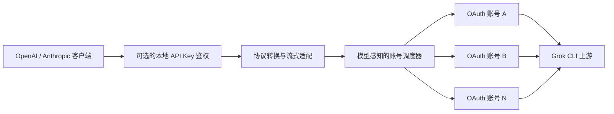

<div align="center">

# grokcli2api-go

**将 Grok CLI 上游能力转换为 OpenAI 与 Anthropic 兼容 API**

轻量、可部署、支持流式响应与多账号调度的 Go 兼容层

[](https://github.com/Futureppo/grokcli2api-go/actions/workflows/ci.yml)
[](https://go.dev/)
[](LICENSE)
[](https://github.com/Futureppo/grokcli2api-go/pkgs/container/grokcli2api-go)

[一键部署](#一键部署linux) · [快速开始](#快速开始) · [API 兼容性](#api-兼容性) · [配置说明](#配置说明) · [接口一览](#接口一览) · [参与贡献](#开发与贡献)

**简体中文** · [English](README_EN.md)

</div>

---

`grokcli2api-go` 是一个使用 Go 编写的非官方 API 兼容服务。它将 Grok CLI 使用的上游接口转换为 OpenAI Chat Completions、OpenAI Responses 与 Anthropic Messages 格式，让现有应用通常只需调整 API Base URL 即可接入。

项目运行时仅依赖 Go 标准库，提供多账号/多 scope 凭证池、自动刷新、账号级模型发现与动态 backend 路由、会话连续性、失败重试和容量背压等能力，适合本地开发、内网服务和容器化部署。

> [!IMPORTANT]
> 本项目是非官方兼容层，与 xAI、X、OpenAI 或 Anthropic 均无隶属或合作关系。使用者应自行遵守相关服务条款，并承担使用非公开上游接口可能产生的兼容性、可用性与账号风险。

## 核心能力

| 类别 | 能力 |
| --- | --- |
| API 兼容 | OpenAI Chat Completions、OpenAI Responses、Anthropic Messages、Grok CLI 原生 Responses 透传 |
| 响应模式 | 流式 SSE 与非流式响应，兼容常见 SDK 和 HTTP 客户端 |
| 凭证管理 | 多账号/多 scope 凭证池、OIDC 自动刷新、目录热加载、锁内原子写回 |
| 智能调度 | 账号轮询、会话亲和、按账号模型 backend/能力动态路由、失败重试与额度冷却 |
| 并发治理 | 账号级并发上限与容量背压，降低高并发场景下的 429 重试风暴 |
| 模型发现 | 按账号获取上游模型目录，缓存、聚合并输出去重后的模型列表 |
| 访问保护 | 可配置一个或多个本地 API Key，并以 Key 派生 tenant namespace 隔离连续性状态 |
| 网络支持 | HTTP、HTTPS、SOCKS5、SOCKS5H 出站代理及标准 `NO_PROXY` 规则 |
| 部署体验 | 单一二进制、优雅退出、Docker 多阶段构建与 Docker Compose 编排 |

## 工作原理



针对不同订阅类型优化，每个请求只会调度到声明支持目标模型的有效账号。

## API 兼容性

| 协议 | 接口 | 流式 | 非流式 |
| --- | --- | :---: | :---: |
| OpenAI | `POST /v1/chat/completions` | ✓ | ✓ |
| OpenAI | `POST /v1/responses` | ✓ | ✓ |
| Anthropic | `POST /v1/messages` | ✓ | ✓ |
| OpenAI | `GET /v1/models` | — | ✓ |

兼容层会尽可能保留常用的请求字段、响应结构和流式事件，但不保证覆盖官方 API 的全部参数与行为。接入 New API 等 API 聚合项目时，请开启所有请求参数的**透传**。

### 按账号动态路由与静默清洗

推理协议以 Grok CLI `0.2.102`（`SOURCE_REV=124d85bc5dc6e7805560215fcc6d5413944920e1`）为基准。服务先验证对外协议的必需结构，再在选定账号后读取该账号、该模型的描述符；描述符中的 wire model 与 `apiBackend` 决定本次请求实际发送到上游 `chat/completions`、`responses` 或 `messages`。同一个公开模型在不同账号上可以使用不同 backend，重试切换账号时会重新渲染路径、请求体、reasoning、工具别名和 SSE 转换。描述符没有声明 backend 时使用 `chat_completions`。

Chat Completions、Responses 与 Anthropic Messages 三个对外接口都可以按账号描述符发送到上述任一 backend。同协议时使用原生清洗，跨协议时只转换双方都能表达的消息、工具与参数；因此 Messages 请求不再固定通过 Responses backend 执行。

无法安全映射的字段、内容块、工具状态或协议专属状态会被静默删除，响应中不会包含兼容 warning 或删除清单。仅当保留字段本身类型非法、缺少公共协议必需字段，或清洗后已没有合法最小输入时返回 `400 invalid_request_error`；请求体超过 16 MiB 返回 `413`。如果 `previous_response_id`、加密 reasoning 或 thinking signature 因目标 backend 无法表达而被删除，本次请求会解除对应 hard affinity 并以新会话执行。

### Reasoning effort

用户显式提供的 reasoning effort 不会因兼容性而被删除。服务会去除首尾空白并统一为小写：模型明确支持的 `minimal`、`low`、`medium`、`high`、`xhigh` 保持不变；`none`、任意未知字符串、模型未列出的档位，以及模型未声明 reasoning 能力时，一律向上游发送 `low`，即使描述符本身没有列出 `low` 也如此。

Chat backend 使用 `reasoning_effort`，Responses backend 使用 `reasoning.effort`，Messages backend 使用 `output_config.effort`。Messages 仅在模型明确支持 `xhigh` 时将其编码为 wire 值 `max`；Anthropic `thinking.type` 仍按独立的 thinking 协议处理。

### Responses 与原生 CLI 格式

普通 `POST /v1/responses` 请求未指定 `store` 时默认发送 `store: true`；明确识别为 Grok CLI 的原生请求默认发送 `store: false`。只有请求包含明确的 Grok CLI 标识时才启用原生响应扩展，包括 `X-XAI-Token-Auth: xai-grok-cli`、`x-grok-client-version`、已知的 Grok 客户端名称/标识，或 `grok-cli/`、`grok-shell/`、`grok-pager/` 等 User-Agent。任意或未知的 `x-grok-client-*` 值不会触发原生格式，普通 Responses 客户端也不会收到 `grok.*` 私有事件。

保留下来的 `previous_response_id` 会固定回到创建该 Response 的账号。显式 `store: false` 的函数工具续接可在进程内回放缓存仍有效时恢复最小调用结构；重启后回放缺失的工具 item 会按静默清洗规则删除，服务不会持久化用户文本、图片、工具参数或 reasoning 内容。

## 快速开始

### 一键部署（Linux）

服务器已安装 Docker 与 Docker Compose v2 时，可直接运行：

```bash
bash <(curl -fsSL https://raw.githubusercontent.com/Futureppo/grokcli2api-go/main/scripts/deploy.sh)
```

脚本会检查 Docker 环境、下载 Compose 配置、创建受保护的 `.env` 和 `auths/` 目录，分别生成随机的本地 API Key 与管理员 Key，并启动及验证服务。交互执行时可以直接导入 OAuth JSON；也可以跳过本地文件，让服务以空凭证池启动，再通过管理员 API 远程上传。已有安装会保留 `.env` 与凭证，可用同一条命令完成镜像更新。

无人值守部署可预先传入参数：

```bash
AUTH_FILE=/root/account.json \
GROK_API_KEYS='sk-change-this-to-a-strong-random-key' \
GROK_ADMIN_KEY='adm-use-an-independent-strong-random-key' \
INSTALL_DIR=/opt/grokcli2api-go \
bash <(curl -fsSL https://raw.githubusercontent.com/Futureppo/grokcli2api-go/main/scripts/deploy.sh)
```

可选变量包括 `GROK2API_PORT`（默认 `8088`）、`INSTALL_DIR`（默认 `~/grokcli2api-go`）、`AUTH_FILE`、`GROK_API_KEYS` 与 `GROK_ADMIN_KEY`。管理员 API 默认启用；设置 `ENABLE_ADMIN_API=0` 可将其关闭，此时没有本地凭证则只初始化配置而不启动服务。

> [!TIP]
> 一键脚本解决的是服务部署，不会替你获取上游凭证。OAuth JSON 属于敏感信息，请只从可信来源导出，并在服务器上以最小权限保存。正式对公网开放前还应配置 HTTPS、反向代理、访问控制和限流。

### 1. 准备项目

运行前需要：

- Docker 与 Docker Compose，或 Go 1.23 及以上版本；
- 至少一份有效的 Grok CLI OAuth JSON 凭证，或配置管理员 Key 后再通过 API 上传；
- 一个可写的凭证目录。

```bash
git clone https://github.com/Futureppo/grokcli2api-go.git
cd grokcli2api-go
cp .env.example .env
mkdir auths
```

Windows PowerShell：

```powershell
git clone https://github.com/Futureppo/grokcli2api-go.git
Set-Location grokcli2api-go
Copy-Item .env.example .env
New-Item -ItemType Directory -Force auths
```

将 Grok CLI 的 `auth.json` 或兼容凭证文件直接放在 `auths/` 下。一个物理文件既可以是旧版单凭证，也可以通过 scope 或 `tokens` 包装包含多个逻辑凭证：

```text
auths/
├── account-1.json
├── account-2.json
└── account-n.json
```

凭证通常需要包含可用的访问令牌或 API Key、刷新信息与稳定的 principal。服务只扫描该目录的第一层，不递归读取子目录；多 scope 文件中的每个逻辑凭证会独立进入账号池。

> [!CAUTION]
> `auths/` 已被 Git 忽略，但仍应作为敏感目录妥善保管。服务会热加载凭证，并在跨进程文件锁保护下将刷新的目标 scope 原子写回原文件，因此目录与文件必须可写。结构化模型目录与 ETag 保存在独立的 state v2 文件中，不会写入新的 CLI 凭证。

### 2. 配置本地访问密钥

编辑 `.env`，将示例值替换为仅供你使用的强随机密钥：

```dotenv
GROK_API_KEYS=sk-kfcvivo50
```

本地 API Key 与上游凭证相互独立，同时也是连续性状态的租户边界：服务使用持久 namespace key 对本地 Key 做 HMAC，为不同 Key 生成不可逆 tenant ID，原始 Key 不会写入状态文件。留空会关闭访问保护，并让所有调用方共享 `public` tenant，无法隔离彼此的会话状态，因此不建议在任何可被其他设备访问的环境中这样做。

### 3. 启动服务

#### Docker Compose（推荐）

```bash
docker compose up -d
docker compose ps
```

查看日志或停止服务：

```bash
docker compose logs -f
docker compose down
```

#### 从源码运行

```bash
go run ./cmd/grok2api
```

#### 使用预构建镜像

```bash
docker pull ghcr.io/futureppo/grokcli2api-go:latest
docker run --rm -p 8088:8088 --env-file .env \
  -v "$(pwd)/auths:/auths" \
  -e GROK_AUTHS_DIR=/auths \
  ghcr.io/futureppo/grokcli2api-go:latest
```

Docker Compose 默认拉取并运行 `ghcr.io/futureppo/grokcli2api-go:latest`。每次推送都会发布 `sha-<commit>` 与对应分支标签，`main` 分支还会更新 `latest`。

### 4. 验证服务

服务默认监听 `http://0.0.0.0:8088`。请将下面的 Key 替换为 `.env` 中的实际值：

```bash
curl http://localhost:8088/

curl http://localhost:8088/v1/models \
  -H "Authorization: Bearer sk-kfcvivo50"
```

## 调用示例

以下示例均使用 `sk-kfcvivo50` 作为占位符，请替换为自己的本地 API Key。

### OpenAI Chat Completions

```bash
curl http://localhost:8088/v1/chat/completions \
  -H "Content-Type: application/json" \
  -H "Authorization: Bearer sk-kfcvivo50" \
  -d '{
    "model": "grok-4.5",
    "messages": [
      {"role": "user", "content": "Hello!"}
    ]
  }'
```

### OpenAI Responses

```bash
curl http://localhost:8088/v1/responses \
  -H "Content-Type: application/json" \
  -H "Authorization: Bearer sk-kfcvivo50" \
  -d '{
    "model": "grok-4.5",
    "input": "Explain what an API compatibility layer does."
  }'
```

默认的多轮续接只需保存上一轮 ID：

```bash
FIRST_ID=$(curl -s http://localhost:8088/v1/responses \
  -H "Content-Type: application/json" \
  -H "Authorization: Bearer sk-kfcvivo50" \
  -d '{"model":"grok-4.5","input":"Remember that my code is 7319."}' | jq -r .id)

curl http://localhost:8088/v1/responses \
  -H "Content-Type: application/json" \
  -H "Authorization: Bearer sk-kfcvivo50" \
  -d "{\"model\":\"grok-4.5\",\"previous_response_id\":\"$FIRST_ID\",\"input\":\"What is my code?\"}"
```

图片可使用 HTTPS URL 或 Base64 data URI，并保持文本与多图的原始顺序：

```json
{
  "model": "grok-4.5",
  "input": [{
    "type": "message",
    "role": "user",
    "content": [
      {"type": "input_text", "text": "Describe this image."},
      {"type": "input_image", "image_url": "https://example.com/image.png", "detail": "high"}
    ]
  }]
}
```

Function 工具结果使用首轮返回的 `call_id`，并将首轮 Response ID 放入 `previous_response_id`：

```json
{
  "model": "grok-4.5",
  "previous_response_id": "resp_...",
  "input": [{"type": "function_call_output", "call_id": "call_...", "output": "sunny, 26 C"}],
  "tools": [{"type": "function", "name": "get_weather", "parameters": {"type": "object", "properties": {"city": {"type": "string"}}, "required": ["city"]}}]
}
```

### Anthropic Messages

```bash
curl http://localhost:8088/v1/messages \
  -H "Content-Type: application/json" \
  -H "x-api-key: sk-kfcvivo50" \
  -H "anthropic-version: 2023-06-01" \
  -d '{
    "model": "grok-4.5",
    "max_tokens": 512,
    "messages": [
      {"role": "user", "content": "Hello!"}
    ]
  }'
```

未设置 `GROK_API_KEYS` 或 `GROK_API_KEY` 时，应移除示例中的本地 API Key 请求头。

## 会话亲和与账号调度

当多个客户端共享同一个本地 API Key 时，建议为每段会话发送稳定且不包含敏感信息的标识：

```http
X-Grok-Session-ID: conversation-123
```

服务按以下优先级识别亲和标识：

- OpenAI `previous_response_id`
- `X-Grok-Session-ID`
- Responses 加密 reasoning 或 Anthropic thinking signature
- OpenAI `prompt_cache_key`
- OpenAI `user`
- Anthropic `metadata.user_id`

`previous_response_id`、显式 session ID 和状态签名属于 hard affinity；`GROK_AUTHS_DIR` 下的 `.grokcli2api-affinity.json` 只保存加入 tenant namespace 后的哈希 binding、账号、模型、backend、上游 session、下一 turn 与过期时间。`prompt_cache_key`、用户字段等 soft affinity 与 `store:false` 工具回放仍只保存在内存中。所有映射都受 TTL 与容量上限控制；本地 API Key 不直接选择账号，但会隔离不同 tenant 的 affinity、Response ownership、状态签名与工具回放。客户端 IP 不参与亲和。

## 配置说明

程序会从当前工作目录的 `.env` 文件中加载尚未设置的环境变量。完整模板与高级客户端标识选项见 [`.env.example`](.env.example)。

### 服务配置

| 环境变量 | 未设置时的默认值 | 说明 |
| --- | --- | --- |
| `GROK2API_HOST` | `0.0.0.0` | 服务监听地址 |
| `GROK2API_PORT` | `8088` | 服务监听端口 |
| `GROK2API_LOG_LEVEL` | `INFO` | 日志等级：`DEBUG`、`INFO`、`WARN` 或 `ERROR` |
| `GROK_API_KEYS` | 空 | 逗号分隔的本地访问密钥，可为不同客户端分配独立 Key |
| `GROK_API_KEY` | 空 | 单个本地访问密钥的兼容别名 |
| `GROK_ADMIN_KEY` | 空 | 独立的管理员密钥；设置后启用远程凭证管理并允许空凭证池启动 |

启用本地访问保护后，受保护接口接受以下任一种请求头：

- `Authorization: Bearer <key>`
- `x-api-key: <key>`
- `api-key: <key>`

管理员密钥与普通 API Key 相互独立。管理接口接受 `Authorization: Bearer <admin-key>` 或 `X-Admin-Key: <admin-key>`，且只应通过 HTTPS 和受限网络暴露。上传凭证可以直接发送 JSON：

```bash
curl http://localhost:8088/v1/admin/credentials \
  -H "Authorization: Bearer $GROK_ADMIN_KEY" \
  -H "Content-Type: application/json" \
  --data-binary @auth.json
```

也可以使用文件表单：

```bash
curl http://localhost:8088/v1/admin/credentials \
  -H "X-Admin-Key: $GROK_ADMIN_KEY" \
  -F "file=@auth.json;type=application/json"
```

服务端按规范化 scope、认证模式与稳定 principal 生成脱敏 ID；旧版无 scope 凭证保持兼容 ID。上传多 scope 文件时，响应通过 `credentials[]` 返回每个逻辑凭证及其 `model_discovery` 状态；单 scope 上传同时保留旧版顶层 `credential`、`created` 与 `model_discovery` 字段。重复上传同一逻辑凭证会在原文件中原子更新目标 scope，临时模型发现失败不会删除已经保存的凭证。

列出脱敏后的凭证状态：

```bash
curl http://localhost:8088/v1/admin/credentials \
  -H "X-Admin-Key: $GROK_ADMIN_KEY"
```

删除逻辑凭证时使用列表返回的 24 位脱敏 ID；多 scope 文件只会移除对应 scope：

```bash
curl -X DELETE http://localhost:8088/v1/admin/credentials/<credential-id> \
  -H "X-Admin-Key: $GROK_ADMIN_KEY"
```

管理接口响应带有 `Cache-Control: no-store`。上传文件限制为 1 MiB，服务会校验 JSON、使用账号身份生成保存路径并以 `0600` 权限原子写入，不会采用客户端提供的文件名。建议优先在服务器本机或 SSH 隧道中管理；如需跨网络访问，必须使用 HTTPS，并在反向代理层限制来源和频率。

### 凭证池与调度

| 环境变量 | 未设置时的默认值 | 说明 |
| --- | --- | --- |
| `GROK_AUTHS_DIR` | `./auths` | 非递归扫描的可写 OAuth JSON 目录 |
| `GROK_AUTHS_RELOAD_INTERVAL` | `30s` | 凭证目录热加载周期 |
| `GROK_AUTH_REFRESH_CONCURRENCY` | `4` | OAuth 刷新的最大并发数 |
| `GROK_ACCOUNT_MAX_INFLIGHT` | `16` | 每账号最大上游在途请求数，超出后等待可用容量 |
| `GROK_MODELS_REFRESH_INTERVAL` | `6h` | 每个账号模型目录的刷新周期 |
| `GROK_RETRY_MAX_ATTEMPTS` | `3` | 单个请求最多尝试的不同账号数 |
| `GROK_RETRY_BASE_DELAY` | `200ms` | 可重试网络错误与上游 5xx 错误的基础退避时间 |
| `GROK_RATE_LIMIT_COOLDOWN` | `1m` | 上游 429 未提供 `Retry-After` 时的冷却时间 |
| `GROK_QUOTA_COOLDOWN` | `24h` | 额度耗尽后的默认冷却时间 |
| `GROK_AFFINITY_TTL` | `1h` | hard/soft affinity 的有效期；hard binding 可持久化，soft binding 仅在内存中 |
| `GROK_AFFINITY_MAX_ENTRIES` | `100000` | 会话亲和缓存的容量上限 |

免费模型额度按账号与模型隔离；账号支出额度耗尽时，整个账号会进入冷却。

### 上游与网络

| 环境变量 | 未设置时的默认值 | 说明 |
| --- | --- | --- |
| `GROK_CHAT_PROXY_BASE_URL` | `https://cli-chat-proxy.grok.com` | Grok CLI 上游地址 |
| `GROK_CHAT_PROXY_VERSION` | `v1` | 上游 API 版本 |
| `GROK_XAI_API_BASE_URL` | `https://api.x.ai` | API Key 账号使用的 xAI API origin；远端模型元数据不能覆盖 |
| `GROK_CLIENT_VERSION` | `0.2.102` | 对齐的 Grok CLI 协议版本 |
| `GROK_CLIENT_MODE` | `headless` | 上游 `x-grok-client-mode`，可选 `headless` 或 `interactive` |
| `GROK_DEPLOYMENT_ID` | 空 | 可选的托管部署 ID，请求时作为 `x-grok-deployment-id` 发送 |
| `GROK_STREAM_COMPRESSION` | `identity` | `identity` 避免 gzip 缓冲 SSE；`gzip` 用于兼容回退 |
| `GROK_PROXY_URL` | 空 | 出站代理，支持 HTTP(S)、SOCKS5 与 SOCKS5H |
| `GROK_NO_PROXY` | 空 | 逗号分隔的代理绕过规则 |
| `GROK_TLS_INSECURE_SKIP_VERIFY` | `false` | 跳过上游 TLS 验证，仅限受控调试环境 |

未设置 `GROK_PROXY_URL` 时，程序遵循标准的 `HTTP_PROXY`、`HTTPS_PROXY`、`ALL_PROXY` 与 `NO_PROXY` 环境变量。

例如通过本机 HTTP 代理 `7890` 访问上游：

```dotenv
GROK_PROXY_URL=http://127.0.0.1:7890
GROK_NO_PROXY=localhost,127.0.0.1
```

命令行参数 `-host` 和 `-port` 可覆盖对应环境变量，`-version` 用于输出当前版本：

```bash
go run ./cmd/grok2api -host 127.0.0.1 -port 8088
go run ./cmd/grok2api -version
```

## 接口一览

### 兼容接口

| 方法 | 路径 | 鉴权 | 说明 |
| --- | --- | :---: | --- |
| `GET` | `/` | 否 | 服务名称、版本与项目地址 |
| `GET` | `/v1/models` | 可选 | 所有有效账号模型目录的去重并集 |
| `GET` | `/v1/models/{model_id}` | 可选 | 指定模型的详情 |
| `GET` | `/v1/auth/api-key` | 否 | 本地 API Key 保护状态 |
| `POST` | `/v1/chat/completions` | 可选 | OpenAI Chat Completions 兼容接口 |
| `POST` | `/v1/responses` | 可选 | OpenAI Responses 兼容接口 |
| `POST` | `/v1/messages` | 可选 | Anthropic Messages 兼容接口 |

“可选”表示仅在配置了本地 API Key 时需要鉴权。

### 管理员凭证接口

仅在设置 `GROK_ADMIN_KEY` 后启用，普通 API Key 无法访问。列表响应不会包含账号标识、文件路径、客户端 ID 或 Token。

| 方法 | 路径 | 说明 |
| --- | --- | --- |
| `GET` | `/v1/admin/credentials` | 列出脱敏的凭证状态和模型目录 |
| `POST` | `/v1/admin/credentials` | 上传或覆盖单 scope/多 scope JSON 凭证，支持 JSON 请求体和 multipart `file` 字段 |
| `DELETE` | `/v1/admin/credentials/{id}` | 删除对应逻辑凭证并立即从调度池移除 |

### Grok 只读透传接口

| 方法 | 路径 |
| --- | --- |
| `GET` | `/v1/grok/settings` |
| `GET` | `/v1/grok/user` |
| `GET` | `/v1/grok/billing` |
| `GET` | `/v1/grok/mcp/configs` |
| `GET` | `/v1/grok/mcp/tools/list` |
| `GET` | `/v1/grok/feedback/config` |

启动时，服务会从 `GROK_AUTHS_DIR` 下的 `.grokcli2api-state.json` v2 读取账号级结构化模型目录、ETag、首次发现时间、冷却状态、全局 agent ID 与 namespace key，并为缺失或超过刷新周期的账号请求上游 `/v1/models`。新增账号也会在目录热加载后自动完成模型发现；旧凭证中的 `models` 字符串数组只在首次联网刷新前作为临时目录。模型目录和 ETag 不再写入新的 CLI 凭证。

`/v1/models` 仍返回标准 OpenAI 模型对象，并在有结构化描述符时附加 `x_grok` 元数据，包括账号间聚合后的 `api_backends`、上下文与输出上限、`reasoning_efforts`、backend search 和流式工具调用能力。backend 取并集，数值上限取最小有效值，reasoning 档位取交集，布尔能力仅在全部候选账号都支持时为 `true`。

实际支持的模型始终以上游账号返回结果为准。调用生成接口前建议先查询 `/v1/models`，并使用返回的准确模型 ID。

## Docker 与镜像说明

项目镜像采用多阶段构建：构建阶段执行完整测试并生成无 CGO 的二进制，运行阶段使用非 root 用户和精简 Alpine 基础镜像。Compose 配置还默认启用只读根文件系统、能力移除、`no-new-privileges` 与健康检查。

本地 `.env` 和 `auths/` 始终作为外部配置与凭证数据使用，重新构建或创建容器不会将它们写入镜像。

## 安全建议

- 切勿提交或公开 OAuth Token、API Key、认证文件及未脱敏日志。
- 对外提供服务前，务必配置 `GROK_API_KEYS`，并在反向代理层启用 HTTPS、访问控制和限流。
- 启用 `GROK_ADMIN_KEY` 时应使用独立的强随机密钥，并额外限制管理接口的来源地址和请求频率。
- 为凭证目录设置最小必要文件权限，并限制可访问该目录的系统用户。
- 除非处于受控调试环境，否则不要启用 `GROK_TLS_INSECURE_SKIP_VERIFY`。
- 不要把会话 ID、用户邮箱或其他敏感数据直接用作亲和标识。
- 安全漏洞请通过 [GitHub Security Advisories](https://github.com/Futureppo/grokcli2api-go/security/advisories/new) 私下报告。

## 开发与贡献

### 本地检查

```bash
gofmt -w path/to/changed.go
go test -count=1 ./...
go test -race -count=1 ./...
go vet ./...
go build -trimpath ./cmd/grok2api
docker build .
```

> `go test -race -count=1 ./...` 需要当前平台支持 Go Race Detector；项目 CI 会在 Linux 环境执行该检查。

### 安全真实 Smoke

只有上面的全部离线门禁（包括 Linux race 与 Docker build）通过后，才可显式运行最多 6 次生成的安全 smoke：

```bash
GROK_LIVE_SMOKE=1 GROK_LIVE_SMOKE_OFFLINE_GATES=passed \
go test -count=1 -run '^TestLiveInferenceSmoke$' ./internal/grok
```

默认源文件是 `auths/live-01.json`，也可用 `GROK_LIVE_SMOKE_AUTH_FILE` 指定。源文件必须只包含一个逻辑凭证；测试仅向服务提供移除了 refresh token、ID token、邮箱和旧模型目录的 `0600` 临时副本，并在结束时核对源文件 SHA-256 与 Git 工作树完全未变。响应正文、Token、账号标识和上游错误体不会输出。

### 真实负载测试

项目提供默认跳过的真实上游负载测试，可报告响应头、首事件、首段非空文本、完成时间与样本覆盖率：

```bash
GROK_LIVE_LOAD=1 GROK_LOAD_MODEL=grok-4 GROK_LOAD_STREAM=1 \
GROK_LOAD_WARMUP=4 GROK_LOAD_CONCURRENCY=4 GROK_LOAD_REQUESTS=16 \
GROK_LOAD_API=responses GROK_LOAD_AFFINITY=cache \
go test ./internal/server -run TestLiveGenerationLoad -v
```

- `GROK_LOAD_API`：`responses`、`chat` 或 `anthropic`
- `GROK_LOAD_AFFINITY`：`none`、`session` 或 `cache`
- `GROK_LOAD_INPUT_BYTES`：生成指定字节数的测试输入

设置 `GROK2API_LOG_LEVEL=DEBUG` 可查看不包含凭证、正文和会话标识的分段耗时日志。

提交代码前请阅读 [CONTRIBUTING.md](CONTRIBUTING.md)。Bug 与功能建议可通过 [GitHub Issues](https://github.com/Futureppo/grokcli2api-go/issues) 提交；Pull Request 应保持主题聚焦，并为协议转换、流式事件或错误处理等改动补充测试。

## 许可证

本项目基于 [GNU Affero General Public License v3.0](LICENSE) 发布。使用、修改或分发本项目时，请遵守许可证中的相应义务。

---

<div align="center">

如果这个项目对你有帮助，欢迎提交 Issue、参与改进或为仓库点亮 Star⭐。

</div>
