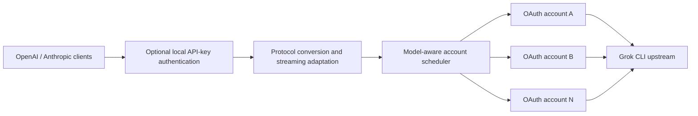

<div align="center">

# grokcli2api-go

**Expose the Grok CLI upstream as OpenAI- and Anthropic-compatible APIs**

A lightweight, deployable Go compatibility layer with streaming and multi-account scheduling

[](https://github.com/Futureppo/grokcli2api-go/actions/workflows/ci.yml)
[](https://go.dev/)
[](LICENSE)
[](https://github.com/Futureppo/grokcli2api-go/pkgs/container/grokcli2api-go)

[One-command deployment](#one-command-deployment-linux) · [Quick Start](#quick-start) · [API Compatibility](#api-compatibility) · [Configuration](#configuration) · [Endpoints](#endpoints) · [Contributing](#development-and-contributing)

[简体中文](README.md) · **English**

</div>

---

`grokcli2api-go` is an unofficial API compatibility service written in Go. It translates the upstream API used by Grok CLI into OpenAI Chat Completions, OpenAI Responses, and Anthropic Messages formats, allowing existing applications to connect by changing their API Base URL in most cases.

The project uses only the Go standard library at runtime and provides a multi-account, multi-scope credential pool, automatic refresh, per-account model discovery and dynamic backend routing, conversation continuity, retries, and capacity backpressure. It is suitable for local development, internal services, and containerized deployments.

> [!IMPORTANT]
> This project is an unofficial compatibility layer and is not affiliated with or endorsed by xAI, X, OpenAI, or Anthropic. Users are responsible for complying with applicable terms of service and for any compatibility, availability, or account risks associated with using a non-public upstream API.

## Core Capabilities

| Category | Capabilities |
| --- | --- |
| API compatibility | OpenAI Chat Completions, OpenAI Responses, Anthropic Messages, and native Grok CLI Responses passthrough |
| Response modes | Streaming SSE and non-streaming responses for common SDKs and HTTP clients |
| Credential management | Multi-account/multi-scope pool, OIDC refresh, directory hot reload, and locked atomic persistence |
| Smart scheduling | Account rotation, session affinity, per-account model backend/capability routing, retries, and quota cooldowns |
| Concurrency control | Per-account concurrency limits and capacity backpressure to reduce 429 retry storms |
| Model discovery | Per-account upstream catalogs with caching, aggregation, and deduplication |
| Access protection | One or more local API keys, with a derived tenant namespace isolating continuity state for each key |
| Network support | HTTP, HTTPS, SOCKS5, and SOCKS5H outbound proxies with standard `NO_PROXY` rules |
| Deployment | Single binary, graceful shutdown, multi-stage Docker build, and Docker Compose configuration |

## How It Works



The service is optimized for different subscription tiers, and each request is routed only to a valid account that advertises support for the requested model.

## API Compatibility

| Protocol | Endpoint | Streaming | Non-streaming |
| --- | --- | :---: | :---: |
| OpenAI | `POST /v1/chat/completions` | ✓ | ✓ |
| OpenAI | `POST /v1/responses` | ✓ | ✓ |
| Anthropic | `POST /v1/messages` | ✓ | ✓ |
| OpenAI | `GET /v1/models` | — | ✓ |

The compatibility layer preserves commonly used request fields, response structures, and streaming events where possible, but it does not guarantee support for every parameter or behavior of the official APIs. When integrating through an API aggregation project such as New API, enable **passthrough** for all request parameters.

### Per-account routing and silent sanitization

The inference contract tracks Grok CLI `0.2.102` (`SOURCE_REV=124d85bc5dc6e7805560215fcc6d5413944920e1`). The service first validates the required public-protocol structure, then reads the selected account's descriptor for that model. The descriptor's wire model and `apiBackend` choose the actual upstream `chat/completions`, `responses`, or `messages` endpoint. The same public model may use different backends on different accounts; when a retry switches accounts, the path, body, reasoning, tool aliases, and SSE adapter are rendered again. A descriptor without a backend uses `chat_completions`.

All three public endpoints—Chat Completions, Responses, and Anthropic Messages—can target any of those account-level backends. Matching protocols use native sanitization; cross-protocol requests convert only the common message, tool, and parameter subset. Messages requests therefore no longer always execute through the Responses backend.

Fields, content blocks, tool state, and protocol-specific state that cannot be mapped safely are silently removed. The response contains no compatibility warning or deletion list. A `400 invalid_request_error` is returned only when a retained field has an invalid type, a required public field is missing, or no valid minimum input remains after cleaning; bodies over 16 MiB return `413`. If `previous_response_id`, encrypted reasoning, or a thinking signature must be removed because the target backend cannot represent it, that hard affinity is released for this request and a new upstream session is used.

### Reasoning effort

An explicitly supplied reasoning effort is never dropped for compatibility. It is trimmed and lowercased: supported `minimal`, `low`, `medium`, `high`, and `xhigh` values are preserved; `none`, every unknown string, any value absent from the model's supported list, and every value sent to a model without declared reasoning capability become `low`. This fallback is still sent even if the descriptor itself does not list `low`.

Chat backends receive `reasoning_effort`, Responses backends receive `reasoning.effort`, and Messages backends receive `output_config.effort`. Messages encode `xhigh` as the wire value `max` only when the model explicitly supports `xhigh`. Anthropic `thinking.type` remains a separate thinking-protocol setting.

### Responses and native CLI format

An ordinary `POST /v1/responses` request defaults an omitted `store` to `true`; a request explicitly recognized as native Grok CLI defaults it to `false`. Native response extensions are enabled only for an explicit Grok CLI identity: `X-XAI-Token-Auth: xai-grok-cli`, `x-grok-client-version`, a recognized Grok client name/identifier, or a `grok-cli/`, `grok-shell/`, or `grok-pager/` User-Agent. Arbitrary or unknown `x-grok-client-*` values do not select the native format, and ordinary Responses clients do not receive private `grok.*` events.

A preserved `previous_response_id` is pinned to the account that created the Response. Function-tool continuation with explicit `store: false` can restore the minimum call shape while its in-process replay entry remains available. After a restart, missing replay items are handled by the same silent-cleaning rule; user text, images, tool arguments, and reasoning content are never persisted by this replay cache.

## Quick Start

### One-command deployment (Linux)

If Docker and Docker Compose v2 are already installed on the server, run:

```bash
bash <(curl -fsSL https://raw.githubusercontent.com/Futureppo/grokcli2api-go/main/scripts/deploy.sh)
```

The script checks Docker, downloads the Compose configuration, creates a protected `.env` file and `auths/` directory, generates separate random local and administrator API keys, and starts and verifies the service. An interactive run can import an OAuth JSON file immediately or start with an empty credential pool so that a credential can be uploaded through the administrator API. Existing installations retain their `.env` and credentials, so the same command also updates the container image.

For unattended deployment, provide the inputs as environment variables:

```bash
AUTH_FILE=/root/account.json \
GROK_API_KEYS='sk-change-this-to-a-strong-random-key' \
GROK_ADMIN_KEY='adm-use-an-independent-strong-random-key' \
INSTALL_DIR=/opt/grokcli2api-go \
bash <(curl -fsSL https://raw.githubusercontent.com/Futureppo/grokcli2api-go/main/scripts/deploy.sh)
```

Optional variables include `GROK2API_PORT` (default `8088`), `INSTALL_DIR` (default `~/grokcli2api-go`), `AUTH_FILE`, `GROK_API_KEYS`, and `GROK_ADMIN_KEY`. The administrator API is enabled by default. Set `ENABLE_ADMIN_API=0` to disable it; without a local credential, that mode initializes the configuration without starting the service.

> [!TIP]
> The deployment script does not obtain upstream credentials for you. OAuth JSON is sensitive: export it only from a trusted source and store it with least-privilege permissions. Configure HTTPS, a reverse proxy, access controls, and rate limiting before exposing the service publicly.

### 1. Prepare the Project

You will need:

- Docker and Docker Compose, or Go 1.23 or later;
- at least one valid Grok CLI OAuth JSON credential, or an administrator key for uploading one through the API; and
- a writable credential directory.

```bash
git clone https://github.com/Futureppo/grokcli2api-go.git
cd grokcli2api-go
cp .env.example .env
mkdir auths
```

Windows PowerShell:

```powershell
git clone https://github.com/Futureppo/grokcli2api-go.git
Set-Location grokcli2api-go
Copy-Item .env.example .env
New-Item -ItemType Directory -Force auths
```

Place Grok CLI `auth.json` or compatible credential files directly under `auths/`. One physical file may contain either a legacy single credential or multiple logical credentials through scopes or a `tokens` wrapper:

```text
auths/
├── account-1.json
├── account-2.json
└── account-n.json
```

Credentials typically need a usable access token or API key, refresh metadata, and a stable principal. The service scans only the first level of this directory and does not search subdirectories recursively; every logical entry in a multi-scope file joins the account pool independently.

> [!CAUTION]
> `auths/` is ignored by Git, but it must still be treated as a sensitive directory. The service hot-reloads credentials and atomically writes only the refreshed target scope back under a cross-process file lock, so the directory and files must be writable. Structured model catalogs and ETags live in the separate state v2 file and are not added to clean CLI credentials.

### 2. Configure a Local Access Key

Edit `.env` and replace the example value with a strong random key used only by your clients:

```dotenv
GROK_API_KEYS=sk-kfcvivo50
```

Local API keys are separate from upstream credentials, but they also define continuity tenants. A persistent namespace key HMACs each local key into a non-reversible tenant ID, and the raw key is never written to state. Leaving the value empty disables access protection and puts every caller in the shared `public` tenant, which cannot isolate callers' conversation state; this is not recommended in any environment reachable by other devices.

### 3. Start the Service

#### Docker Compose (recommended)

```bash
docker compose up -d
docker compose ps
```

View logs or stop the service:

```bash
docker compose logs -f
docker compose down
```

#### Run from source

```bash
go run ./cmd/grok2api
```

#### Use the prebuilt image

```bash
docker pull ghcr.io/futureppo/grokcli2api-go:latest
docker run --rm -p 8088:8088 --env-file .env \
  -v "$(pwd)/auths:/auths" \
  -e GROK_AUTHS_DIR=/auths \
  ghcr.io/futureppo/grokcli2api-go:latest
```

Docker Compose pulls and runs `ghcr.io/futureppo/grokcli2api-go:latest` by default. Every push publishes a `sha-<commit>` tag and a matching branch tag; pushes to `main` also update `latest`.

### 4. Verify the Service

The service listens on `http://0.0.0.0:8088` by default. Replace the key below with the value configured in `.env`:

```bash
curl http://localhost:8088/

curl http://localhost:8088/v1/models \
  -H "Authorization: Bearer sk-kfcvivo50"
```

## Usage Examples

The examples below use `sk-kfcvivo50` as a placeholder. Replace it with your local API key.

### OpenAI Chat Completions

```bash
curl http://localhost:8088/v1/chat/completions \
  -H "Content-Type: application/json" \
  -H "Authorization: Bearer sk-kfcvivo50" \
  -d '{
    "model": "grok-4.5",
    "messages": [
      {"role": "user", "content": "Hello!"}
    ]
  }'
```

### OpenAI Responses

```bash
curl http://localhost:8088/v1/responses \
  -H "Content-Type: application/json" \
  -H "Authorization: Bearer sk-kfcvivo50" \
  -d '{
    "model": "grok-4.5",
    "input": "Explain what an API compatibility layer does."
  }'
```

For a default stateful conversation, retain only the previous response ID:

```bash
FIRST_ID=$(curl -s http://localhost:8088/v1/responses \
  -H "Content-Type: application/json" \
  -H "Authorization: Bearer sk-kfcvivo50" \
  -d '{"model":"grok-4.5","input":"Remember that my code is 7319."}' | jq -r .id)

curl http://localhost:8088/v1/responses \
  -H "Content-Type: application/json" \
  -H "Authorization: Bearer sk-kfcvivo50" \
  -d "{\"model\":\"grok-4.5\",\"previous_response_id\":\"$FIRST_ID\",\"input\":\"What is my code?\"}"
```

Images can use an HTTPS URL or a Base64 data URI while preserving mixed text/image order:

```json
{
  "model": "grok-4.5",
  "input": [{
    "type": "message",
    "role": "user",
    "content": [
      {"type": "input_text", "text": "Describe this image."},
      {"type": "input_image", "image_url": "https://example.com/image.png", "detail": "high"}
    ]
  }]
}
```

For a Function result, use the `call_id` returned by the first turn and pass that turn's Response ID as `previous_response_id`:

```json
{
  "model": "grok-4.5",
  "previous_response_id": "resp_...",
  "input": [{"type": "function_call_output", "call_id": "call_...", "output": "sunny, 26 C"}],
  "tools": [{"type": "function", "name": "get_weather", "parameters": {"type": "object", "properties": {"city": {"type": "string"}}, "required": ["city"]}}]
}
```

### Anthropic Messages

```bash
curl http://localhost:8088/v1/messages \
  -H "Content-Type: application/json" \
  -H "x-api-key: sk-kfcvivo50" \
  -H "anthropic-version: 2023-06-01" \
  -d '{
    "model": "grok-4.5",
    "max_tokens": 512,
    "messages": [
      {"role": "user", "content": "Hello!"}
    ]
  }'
```

If neither `GROK_API_KEYS` nor `GROK_API_KEY` is configured, remove the local API-key header from these examples.

## Session Affinity and Account Scheduling

When multiple clients share one local API key, send a stable, non-sensitive identifier for each conversation:

```http
X-Grok-Session-ID: conversation-123
```

The service recognizes affinity inputs in this priority order:

- OpenAI `previous_response_id`
- `X-Grok-Session-ID`
- encrypted Responses reasoning or an Anthropic thinking signature
- OpenAI `prompt_cache_key`
- OpenAI `user`
- Anthropic `metadata.user_id`

`previous_response_id`, an explicit session ID, and state signatures create hard affinity. The `.grokcli2api-affinity.json` file under `GROK_AUTHS_DIR` contains only the tenant-namespaced hashed binding, account, model, backend, upstream session, next turn, and expiry. Soft affinity from cache/user fields and `store:false` tool replay remain in memory only. Every mapping is bounded by the configured TTL and capacity. A local API key does not directly choose an account, but it isolates affinity, Response ownership, state signatures, and replay data between tenants; client IP addresses are not used.

## Configuration

The service loads environment variables that are not already set from a `.env` file in the current working directory. See [`.env.example`](.env.example) for the complete template and advanced client-identity options.

### Server

| Environment variable | Default when unset | Description |
| --- | --- | --- |
| `GROK2API_HOST` | `0.0.0.0` | Service bind address |
| `GROK2API_PORT` | `8088` | Service bind port |
| `GROK2API_LOG_LEVEL` | `INFO` | `DEBUG`, `INFO`, `WARN`, or `ERROR` |
| `GROK_API_KEYS` | empty | Comma-separated local access keys; separate keys may be assigned to different clients |
| `GROK_API_KEY` | empty | Backward-compatible alias for one local access key |
| `GROK_ADMIN_KEY` | empty | Independent administrator key; enables remote credential management and empty-pool startup |

When local access protection is enabled, protected endpoints accept any of these headers:

- `Authorization: Bearer <key>`
- `x-api-key: <key>`
- `api-key: <key>`

The administrator key is independent from normal API keys. Management endpoints accept `Authorization: Bearer <admin-key>` or `X-Admin-Key: <admin-key>` and should only be exposed through HTTPS on a restricted network. Upload a credential as a JSON request body:

```bash
curl http://localhost:8088/v1/admin/credentials \
  -H "Authorization: Bearer $GROK_ADMIN_KEY" \
  -H "Content-Type: application/json" \
  --data-binary @auth.json
```

Or upload it as a file form:

```bash
curl http://localhost:8088/v1/admin/credentials \
  -H "X-Admin-Key: $GROK_ADMIN_KEY" \
  -F "file=@auth.json;type=application/json"
```

The server derives a redacted ID from the normalized scope, authentication mode, and stable principal; legacy unscoped credentials retain the compatible ID rule. A multi-scope upload returns every logical entry and its `model_discovery` status in `credentials[]`; a single-scope upload also retains the legacy top-level `credential`, `created`, and `model_discovery` fields. Uploading the same logical credential atomically updates only its target scope, and a temporary discovery failure does not remove it.

List redacted credential status:

```bash
curl http://localhost:8088/v1/admin/credentials \
  -H "X-Admin-Key: $GROK_ADMIN_KEY"
```

Delete a logical credential using the 24-character redacted ID returned by the list endpoint. For a multi-scope file, only that scope is removed:

```bash
curl -X DELETE http://localhost:8088/v1/admin/credentials/<credential-id> \
  -H "X-Admin-Key: $GROK_ADMIN_KEY"
```

Administrator responses include `Cache-Control: no-store`. Uploads are limited to 1 MiB; the service validates the JSON, derives the destination from the account identity, and atomically writes it with mode `0600` instead of trusting the client filename. Prefer administration over loopback or an SSH tunnel. Cross-network access must use HTTPS with source and rate restrictions at the reverse proxy.

### Credential Pool and Scheduling

| Environment variable | Default when unset | Description |
| --- | --- | --- |
| `GROK_AUTHS_DIR` | `./auths` | Writable, non-recursive OAuth JSON directory |
| `GROK_AUTHS_RELOAD_INTERVAL` | `30s` | Credential directory hot-reload interval |
| `GROK_AUTH_REFRESH_CONCURRENCY` | `4` | Maximum concurrent OAuth refreshes |
| `GROK_ACCOUNT_MAX_INFLIGHT` | `16` | Maximum upstream requests in flight per account; excess requests wait for capacity |
| `GROK_MODELS_REFRESH_INTERVAL` | `6h` | Per-account model-catalog refresh interval |
| `GROK_RETRY_MAX_ATTEMPTS` | `3` | Maximum number of distinct accounts tried per request |
| `GROK_RETRY_BASE_DELAY` | `200ms` | Base delay for retryable network and upstream 5xx failures |
| `GROK_RATE_LIMIT_COOLDOWN` | `1m` | Cooldown when an upstream 429 omits `Retry-After` |
| `GROK_QUOTA_COOLDOWN` | `24h` | Default cooldown after quota exhaustion |
| `GROK_AFFINITY_TTL` | `1h` | Lifetime of hard and soft affinity; hard bindings may persist, while soft bindings remain in memory |
| `GROK_AFFINITY_MAX_ENTRIES` | `100000` | Maximum number of affinity-cache entries |

Free-model quota cooldowns are isolated by account and model. An exhausted spending limit cools down the entire account.

### Upstream and Network

| Environment variable | Default when unset | Description |
| --- | --- | --- |
| `GROK_CHAT_PROXY_BASE_URL` | `https://cli-chat-proxy.grok.com` | Grok CLI upstream URL |
| `GROK_CHAT_PROXY_VERSION` | `v1` | Upstream API version |
| `GROK_XAI_API_BASE_URL` | `https://api.x.ai` | Operator-controlled xAI API origin for API-key accounts; remote model metadata cannot override it |
| `GROK_CLIENT_VERSION` | `0.2.102` | Grok CLI protocol version advertised upstream |
| `GROK_CLIENT_MODE` | `headless` | Upstream `x-grok-client-mode`; `headless` or `interactive` |
| `GROK_DEPLOYMENT_ID` | empty | Optional managed deployment ID sent as `x-grok-deployment-id` |
| `GROK_STREAM_COMPRESSION` | `identity` | `identity` avoids buffering SSE through gzip; `gzip` is a compatibility fallback |
| `GROK_PROXY_URL` | empty | HTTP(S), SOCKS5, or SOCKS5H outbound proxy |
| `GROK_NO_PROXY` | empty | Comma-separated proxy bypass rules |
| `GROK_TLS_INSECURE_SKIP_VERIFY` | `false` | Disable upstream TLS verification; controlled debugging only |

When `GROK_PROXY_URL` is unset, the service honors the standard `HTTP_PROXY`, `HTTPS_PROXY`, `ALL_PROXY`, and `NO_PROXY` environment variables.

For example, to use a local HTTP proxy on port `7890`:

```dotenv
GROK_PROXY_URL=http://127.0.0.1:7890
GROK_NO_PROXY=localhost,127.0.0.1
```

The `-host` and `-port` command-line flags override the corresponding environment variables. Use `-version` to print the current version:

```bash
go run ./cmd/grok2api -host 127.0.0.1 -port 8088
go run ./cmd/grok2api -version
```

## Endpoints

### Compatible APIs

| Method | Path | Authentication | Description |
| --- | --- | :---: | --- |
| `GET` | `/` | No | Service name, version, and project URL |
| `GET` | `/v1/models` | Optional | Deduplicated union of model catalogs from all valid accounts |
| `GET` | `/v1/models/{model_id}` | Optional | Details for a specific model |
| `GET` | `/v1/auth/api-key` | No | Local API-key protection status |
| `POST` | `/v1/chat/completions` | Optional | OpenAI-compatible Chat Completions |
| `POST` | `/v1/responses` | Optional | OpenAI-compatible Responses |
| `POST` | `/v1/messages` | Optional | Anthropic-compatible Messages |

“Optional” means authentication is required only when a local API key has been configured.

### Administrator Credential APIs

These endpoints are registered only when `GROK_ADMIN_KEY` is set, and normal API keys cannot access them. List responses never expose account subjects, file paths, client IDs, or tokens.

| Method | Path | Description |
| --- | --- | --- |
| `GET` | `/v1/admin/credentials` | List redacted credential status and model catalogs |
| `POST` | `/v1/admin/credentials` | Upload or replace single- or multi-scope JSON credentials using a JSON body or multipart `file` field |
| `DELETE` | `/v1/admin/credentials/{id}` | Delete the matching logical credential and immediately remove it from scheduling |

### Read-only Grok Passthrough APIs

| Method | Path |
| --- | --- |
| `GET` | `/v1/grok/settings` |
| `GET` | `/v1/grok/user` |
| `GET` | `/v1/grok/billing` |
| `GET` | `/v1/grok/mcp/configs` |
| `GET` | `/v1/grok/mcp/tools/list` |
| `GET` | `/v1/grok/feedback/config` |

At startup, the service reads per-account structured catalogs, ETags, first-seen times, cooldowns, the global agent ID, and the namespace key from the `.grokcli2api-state.json` v2 file under `GROK_AUTHS_DIR`. It requests upstream `/v1/models` for accounts whose catalog is missing or stale, and newly hot-loaded accounts are discovered automatically. A legacy credential's `models` string array is only a provisional catalog until the first online refresh. Catalogs and ETags are no longer added to clean CLI credentials.

`/v1/models` remains an OpenAI model list and adds `x_grok` metadata when a structured descriptor is available: aggregated `api_backends`, context and output limits, `reasoning_efforts`, backend-search support, and streaming tool-call support. Backends are unioned, positive numeric limits use the minimum, efforts are intersected, and booleans are `true` only when every candidate account supports them.

Actual model availability is always controlled by the upstream account. Query `/v1/models` before generating content and use the exact model ID returned by the service.

## Docker and Image Design

The project image uses a multi-stage build: the build stage runs the complete test suite and produces a CGO-free binary, while the runtime stage uses a non-root user and a minimal Alpine base image. The Compose configuration also enables a read-only root filesystem, drops Linux capabilities, sets `no-new-privileges`, and defines a health check by default.

Local `.env` and `auths/` data remain external configuration and credential storage. Rebuilding or recreating the container does not bake them into the image.

## Security

- Never commit or disclose OAuth tokens, API keys, authentication files, or unsanitized logs.
- Configure `GROK_API_KEYS` before exposing the service to a network, and enable HTTPS, access control, and rate limiting at the reverse proxy.
- When enabling `GROK_ADMIN_KEY`, use a separate strong random key and apply additional source-address and rate restrictions to the management endpoints.
- Apply least-privilege file permissions to the credential directory and restrict which system users can access it.
- Do not enable `GROK_TLS_INSECURE_SKIP_VERIFY` outside a controlled debugging environment.
- Do not use session IDs, email addresses, or other sensitive data directly as affinity identifiers.
- Report vulnerabilities privately through [GitHub Security Advisories](https://github.com/Futureppo/grokcli2api-go/security/advisories/new).

## Development and Contributing

### Local Checks

```bash
gofmt -w path/to/changed.go
go test -count=1 ./...
go test -race -count=1 ./...
go vet ./...
go build -trimpath ./cmd/grok2api
docker build .
```

> `go test -race -count=1 ./...` requires a platform supported by the Go Race Detector. The project CI runs this check on Linux.

### Safe Live Smoke

Run the at-most-six-generation live smoke only after every offline gate above, including the Linux race test and Docker build, has passed:

```bash
GROK_LIVE_SMOKE=1 GROK_LIVE_SMOKE_OFFLINE_GATES=passed \
go test -count=1 -run '^TestLiveInferenceSmoke$' ./internal/grok
```

The default source is `auths/live-01.json`; override it with `GROK_LIVE_SMOKE_AUTH_FILE`. The source must contain exactly one logical credential. Only a `0600` temporary copy with refresh tokens, ID tokens, email fields, and stale legacy model lists removed is exposed to the service. The test verifies that the source SHA-256 and Git worktree remain unchanged, and never prints response bodies, tokens, account identifiers, or upstream error bodies.

### Live Load Testing

The project includes an opt-in live upstream load test that reports response headers, first event, first non-empty text, completion latency, and sample coverage:

```bash
GROK_LIVE_LOAD=1 GROK_LOAD_MODEL=grok-4 GROK_LOAD_STREAM=1 \
GROK_LOAD_WARMUP=4 GROK_LOAD_CONCURRENCY=4 GROK_LOAD_REQUESTS=16 \
GROK_LOAD_API=responses GROK_LOAD_AFFINITY=cache \
go test ./internal/server -run TestLiveGenerationLoad -v
```

- `GROK_LOAD_API`: `responses`, `chat`, or `anthropic`
- `GROK_LOAD_AFFINITY`: `none`, `session`, or `cache`
- `GROK_LOAD_INPUT_BYTES`: generate a test input of the specified size in bytes

Set `GROK2API_LOG_LEVEL=DEBUG` to inspect segmented timing logs that omit credentials, request bodies, and session identifiers.

Read [CONTRIBUTING.md](CONTRIBUTING.md) before submitting changes. Report bugs and feature requests through [GitHub Issues](https://github.com/Futureppo/grokcli2api-go/issues). Pull requests should remain focused and include tests for protocol conversion, streaming events, or error handling as appropriate.

## License

This project is licensed under the [GNU Affero General Public License v3.0](LICENSE). When using, modifying, or distributing this project, comply with the corresponding license obligations.

---

<div align="center">

If this project helps you, contributions, issues, and stars are always welcome ⭐.

</div>
